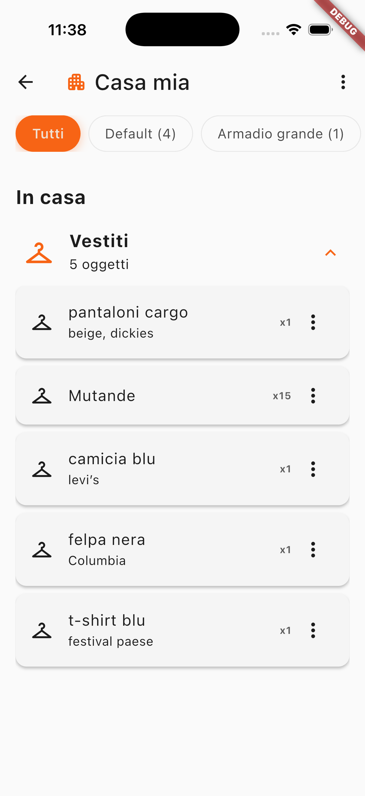
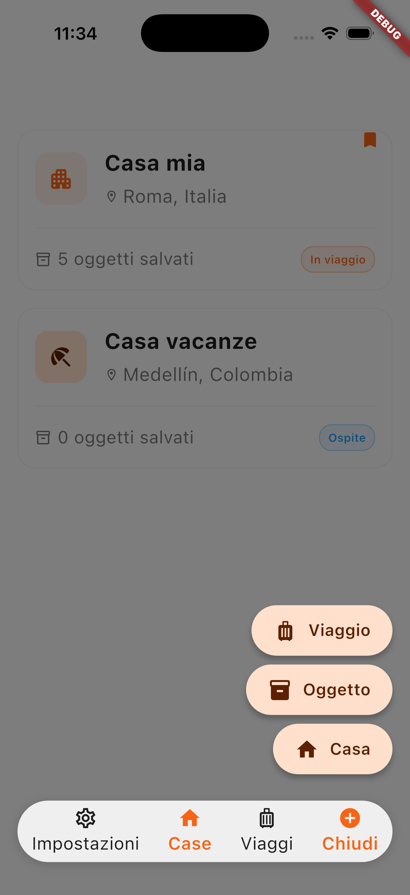
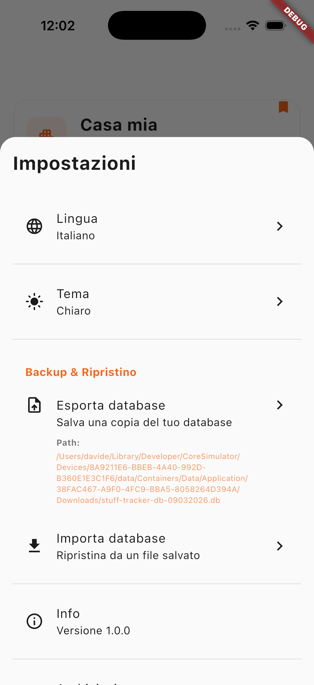

# 📦 Stuff Tracker

<p align="center">
  
  
  
  
</p>

**Stuff Tracker** è un'applicazione mobile multipiattaforma (iOS/Android) progettata per la gestione intelligente di oggetti personali distribuiti in diverse abitazioni e il tracking di viaggi e spostamenti. 

L'app risolve un problema estremamente pratico: dimenticare dove si trovano i propri oggetti quando si possiedono più case o si viaggia frequentemente.

---

## 📱 Screenshots

<p align="center">
  
  &nbsp;&nbsp;
  
  &nbsp;&nbsp;
  
  &nbsp;&nbsp;
  
  &nbsp;&nbsp;
  
  &nbsp;&nbsp;
  
  &nbsp;&nbsp;
  
  &nbsp;&nbsp;
  
  &nbsp;&nbsp;
</p>

---

## ✨ Features Principali

* 🏠 **Gestione Multi-Abitazione (Houses):** CRUD completo con geolocalizzazione integrata tramite Geoapify, selezione di icone personalizzate e statistiche in tempo reale degli oggetti.
* 🎒 **Gestione Inventario (Items):** Catalogazione in 4 categorie (Vestiti, Toiletries, Elettronica, Varie) con tracciamento delle quantità e stati dinamici per capire se un oggetto è "Disponibile" o "In Transito".
* ✈️ **Gestione Viaggi (Trips):** Pianificazione spostamenti con timeline temporale, calcolo automatico dello stato (Upcoming, Active, Completed) e checklist dinamiche degli oggetti da portare.
* 💾 **Disaster Recovery & Backup:** Sistema di export/import del database SQLite fisico con backup di sicurezza automatico pre-import, validazione dello schema post-import e rollback automatico in caso di corruzione dei dati.
* 🎨 **UX/UI & i18n:** Supporto Tema Chiaro/Scuro/Sistema, Design System proprietario e internazionalizzazione completa (it-IT, en-US) senza stringhe hardcoded.

---

## 🏗 Architettura e Scelte Progettuali (Il "Perché")

Invece di procedere per tentativi, l'app è stata ingegnerizzata seguendo la **Feature-First Architecture** combinata con i principi della **Clean Architecture**. Questo garantisce una separazione netta delle responsabilità e un'elevata testabilità.

Ecco i trade-off principali e le decisioni architetturali affrontate durante lo sviluppo:

### 1️⃣ Database Relazionale (Drift) vs NoSQL (Hive/Isar)
Sebbene soluzioni NoSQL offrano velocità di prototipazione, la scelta è ricaduta su **Drift (SQLite)** per via della necessità di gestire query complesse (join tra abitazioni, oggetti e viaggi), garantire l'integrità referenziale tramite Foreign Keys (con cascade deletes) e gestire migrazioni di schema robuste e type-safe a compile-time.

### 2️⃣ Snapshot Pattern per i Viaggi
Quando un utente inserisce un oggetto in un viaggio, il sistema non crea una semplice reference, ma una **copia indipendente (Snapshot)** dell'oggetto (`TripItem`). 
> **Perché?** L'immutabilità garantisce che se l'utente modifica o elimina l'oggetto originale dalla casa settimane dopo, lo storico del viaggio passato non venga alterato. Il viaggio mantiene la sua autonomia.

### 3️⃣ Backup Fisico vs Serializzazione JSON
Il sistema di backup esporta il file fisico `.db`.
> **Perché?** La copia a livello di file system è ordini di grandezza più veloce della serializzazione/deserializzazione JSON, azzera il rischio di perdita dati per errori di parsing e garantisce l'atomicità tipica delle transazioni SQLite.

### 4️⃣ Post-Import Validation e Rollback
Poiché Drift esegue le migrazioni in modalità *lazy* (solo alla prima query), un database importato e incompatibile causerebbe un crash ritardato e irrecuperabile. Il sistema di restore forza una riconnessione immediata (`SELECT 1`). Se il check fallisce per un mismatch di schema, l'app esegue un rollback trasparente utilizzando il safety backup generato al momento dell'import, garantendo stabilità assoluta.

---

## 💻 Stack Tecnologico (Il "Come")

Il progetto utilizza un toolchain moderno e fortemente tipizzato, rispettando i principi SOLID.

* **Core:** Flutter 3.10+, Dart 3.10.4
* **State Management:** Riverpod 2.5 (con code generation tramite `riverpod_annotation` per provider isolati e auto-dispose)
* **Database:** Drift 2.22.1 (ORM SQLite)
* **Routing:** GoRouter 14.2 (Routing dichiarativo, supporto per deep linking e `StatefulShellRoute`)
* **Immutabilità & JSON:** Freezed, json_serializable
* **API/Integrazioni:** Http (per Geoapify API)

### 🗄 Struttura Database (SQLite)
Il DB è alla versione 3 dello schema e comprende le seguenti entità principali:
* `houses`: Tabella principale delle abitazioni con coordinate e flag `is_primary`.
* `items`: Oggetti inventariati, collegati con FK a `houses(id)`.
* `trips`: Spostamenti programmati con destinazione e date.
* `trip_item_entries`: Tabella di associazione con chiave primaria composita `(id, trip_id)` che implementa lo Snapshot Pattern per gli oggetti portati in viaggio.

---

## 🚀 Setup & Installazione

### 📋 Prerequisiti
* Flutter SDK 3.10+
* Dart 3.10.4+
* Account [Geoapify](https://www.geoapify.com/) (per ottenere l'API Key gratuita)

### 🛠 Avvio Veloce

1. **Clona la repository**
   ```bash
   git clone [https://github.com/tuo-username/stuff-tracker.git](https://github.com/tuo-username/stuff-tracker.git)
   cd stuff-tracker

    ```

2. **Scarica le dipendenze**
```bash
flutter pub get

```


3. **Configura le API Keys (Gestione Segreti)**
Il progetto richiede una chiave API per il geocoding. Per ragioni di sicurezza, le chiavi non sono versionate nel repository.
* Crea un file chiamato `.env` nella cartella principale del progetto.
* Inserisci la tua chiave Geoapify in questo formato:
```env
GEOAPIFY_KEY=la_tua_api_key_qui

```


4. **Genera il codice (Drift, Freezed, Riverpod)**
> ⚠️ **Nota:** Questo passaggio è essenziale prima del primo avvio per creare le tabelle del DB, i model immutabili e i provider.


```bash
dart run build_runner build --delete-conflicting-outputs

```


5. **Avvia l'app**
```bash
flutter run

```


### ⚙️ Code Generation in Sviluppo

Se stai lavorando attivamente sul codice e modifichi modelli o provider, avvia il watch mode per la rigenerazione automatica:

```bash
dart run build_runner watch

```

---

## 🧪 Testing e Manutenzione (WIP)

Il progetto è predisposto per abbracciare pratiche di **TDD (Test-Driven Development)**, supportato dall'astrazione dei Repository (`DriftHouseRepository` vs `HouseRepository`) che permette l'injection di mock durante i test.

È presente un sistema di `DataIntegrityService` che esegue health checks al lancio dell'app per individuare e riparare foreign keys orfane o inconsistenze.
